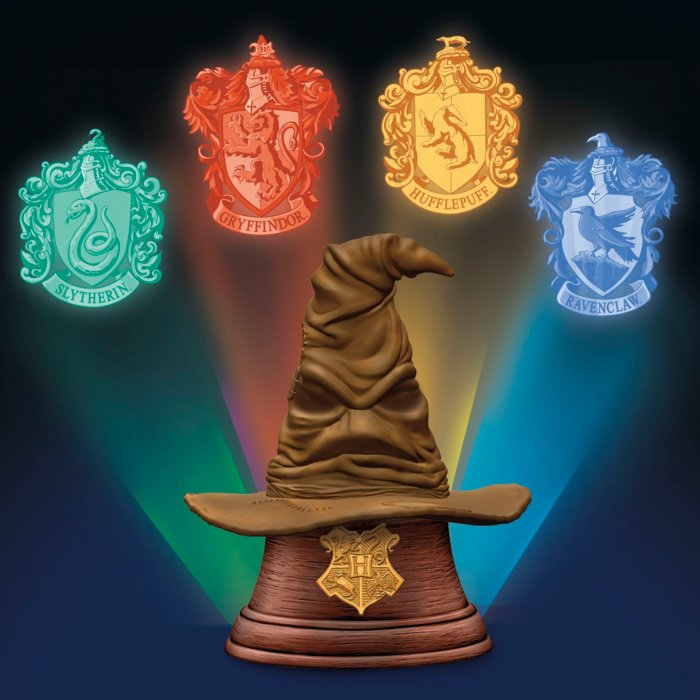
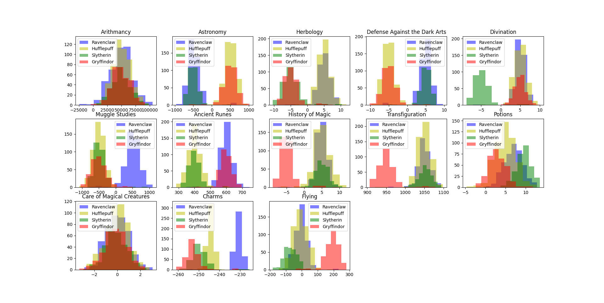
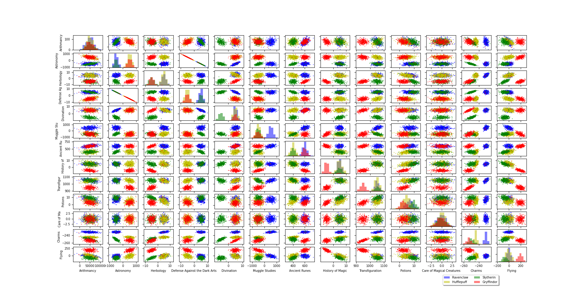

# dslr
This project marked my initial encounter with logistic regression. Its objective is to assist Professor McGonagall in sorting Hogwarts students into the school house that best suits them.

[Pierrickjay](https://github.com/Pierrickjay) and I decided to help Professor McGonagall.

Although I may not entirely agree with her approach, Professor McGonagall is convinced that sorting should be based on the students' grades as features. We are utilizing a dataset containing grades of approximately 1600 students.

  

## Data Visualization
I commenced by visualizing the dataset using histograms and pair plots:

This indicates that Arithmancy and Care of Magical Creatures are not particularly useful features.

This demonstrates that Astronomy and Defense Against the Dark Arts are correlated, suggesting that we can utilize one without losing valuable information.

## Training
Our training program, logred_predict.py, trains a logistic regression model. We utilize a One Vs All classification approach to determine the best Hogwarts House for the students.

## Prediction
The **logreg_predict.py** loads the model and utilizes it to replace the Sorting Hat.

